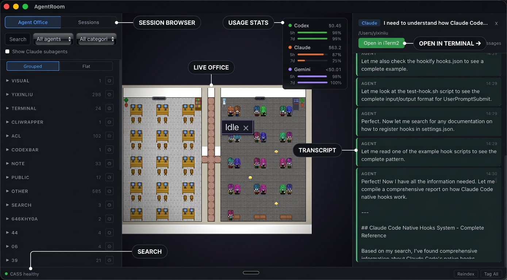

# agentroom-win

> **Just my working build.** This is a personal Windows 11 port of [AgentRoom](https://github.com/liuyixin-louis/agentroom) by Yixin Liu. The original did not build or run on Windows out of the box. With the help of Claude (Anthropic), I diagnosed and fixed the issues. Sessions now show, agents animate, transcripts load — on Windows 11.



---

## What is AgentRoom?

AgentRoom is a desktop app that turns your AI coding agents into animated pixel art characters in a virtual office — with full session search, transcript browsing, and real-time activity monitoring across Claude Code, Codex, and Gemini.

It was built by **Yixin Liu** ([liuyixin-louis](https://github.com/liuyixin-louis)) and uses the [CASS](https://github.com/Dicklesworthstone/coding_agent_session_search) search backend and [frankentui](https://github.com/Dicklesworthstone/frankentui) TUI framework by **Jeffrey Emanuel** ([Dicklesworthstone](https://github.com/Dicklesworthstone)).

All credit for the original concept, design, and implementation goes to them. This repo exists purely because I wanted it running on my Windows machine and it took real effort to get there.

---

## My Original Problem

I cloned the original repo, got it to build... but the app launched with **no sessions and no agents visible**. The virtual room was empty. Nothing worked.

After digging in with Claude, we found the root cause was a chain of five separate issues — none of which had anything to do with my sessions not existing. They were all build and platform compatibility bugs that only surface on Windows.

---

## What Was Wrong (and What Was Fixed)

All fixes were diagnosed with [Claude Sonnet 4.6](https://claude.ai) during a live debugging session on 2026-03-16.

### Fix 1 — CASS binary was a Linux ELF, not a Windows executable

The `search-backend/cass/target/release/cass` file committed in the original submodule was compiled on Linux. It cannot execute on Windows at all (`Exec format error`). The app was silently failing every time it tried to run CASS — so it returned zero sessions.

**Fix:** Build CASS natively for Windows:
```powershell
cd search-backend\cass
cargo build --release
# produces: search-backend\cass\target\release\cass.exe
```

### Fix 2 — `cass_bin()` used a hardcoded wrong path and ignored Windows `HOME`

In `src-tauri/src/commands.rs`, the `cass_bin()` function resolved the CASS binary path using `env::var("HOME")` — which is not set in native Windows processes. The fallback path also pointed to a pre-submodule location (`~/Projects/AgentRoom/cass/...`) that no longer existed.

**Fix:** Updated `cass_bin()` to:
- Fall back to `USERPROFILE` when `HOME` is unset (Windows)
- Append `.exe` on Windows via `#[cfg(windows)]`
- Use a compile-time path constant emitted by `build.rs` pointing to the correct submodule binary location

### Fix 3 — `frankentui` exposed Unix-only TTY backend on all platforms

`ftui-tty::TtyBackend::open()` is correctly gated `#[cfg(unix)]` inside the `ftui-tty` crate. But `ftui-runtime/src/program.rs` wrapped it in a `Program::with_native_backend()` constructor gated only on `#[cfg(feature = "native-backend")]` — no Unix check. On Windows, the type existed but `open()` didn't, causing:

```
error[E0599]: no function or associated item named `open` found for struct `TtyBackend`
```

**Fix:** Changed all `#[cfg(feature = "native-backend")]` items that touch TTY code to `#[cfg(all(unix, feature = "native-backend"))]` in:
- `frankentui/crates/ftui-runtime/src/program.rs` (impl block, `run_native()`, its stub fallback, 3 test functions)
- `frankentui/crates/ftui-runtime/src/lib.rs` (`TtyBackend` re-export)

### Fix 4 — CASS called `with_native_backend()` unconditionally

Even after Fix 3, CASS's own `run_tui_ftui()` function in `src/ui/app.rs` called `ftui::Program::with_native_backend()` directly with no platform guard — so it still failed on Windows.

**Fix:** Split the call with platform cfg:
```rust
#[cfg(unix)]
let mut program = ftui::Program::with_native_backend(model, config)?;
#[cfg(not(unix))]
let mut program = ftui::Program::with_config(model, config)?; // crossterm-compat on Windows
```

Both backends expose the same `run()` / `start_recording()` / `stop_recording()` API so no other changes were needed.

### Fix 5 — Missing `icon.ico` for Windows resource file

Tauri requires `icon.ico` to generate a Windows resource file during build. The original repo only had PNG icons.

**Fix:**
```powershell
npx tauri icon src-tauri/icons/128x128.png
```

### Fix 6 — CASS index was never built

After all the above, the app launched but still showed no sessions. The final piece: CASS's `timeline` command only returns results from its index — it doesn't scan `.jsonl` files on demand. The index needs to be built once before sessions appear.

**Fix:**
```powershell
.\search-backend\cass\target\release\cass.exe index --full
```

---

## Quick Start (Windows 11)

### Prerequisites

- [Rust](https://rustup.rs) (install via rustup, use the MSVC toolchain)
- [Node.js 18+](https://nodejs.org)
- [Microsoft C++ Build Tools](https://visualstudio.microsoft.com/visual-cpp-build-tools/) (required by Tauri on Windows)
- [WebView2](https://developer.microsoft.com/en-us/microsoft-edge/webview2/) (usually pre-installed on Windows 11)

### Build and Run

```powershell
# 1. Clone
git clone https://github.com/NooRotic/agentroom-win.git
cd agentroom-win

# 2. Build the CASS search backend (run from PowerShell, not Git Bash)
#    First time only — takes 3-8 minutes
cd search-backend\cass
cargo build --release
cd ..\..

# 3. Index your agent sessions (first time only)
.\search-backend\cass\target\release\cass.exe index --full

# 4. Install frontend deps and launch
npm install
npm run tauri dev
```

### Verifying CASS works

```powershell
.\search-backend\cass\target\release\cass.exe health --json
.\search-backend\cass\target\release\cass.exe timeline --json --group-by none --since 90d
```

---

## What This Repo Is (and Isn't)

- This is **my personal working build** on Windows 11 — not an official port, not endorsed by the original authors
- The `search-backend/` code is vendored directly (not submodules) so the repo is fully self-contained
- I made the minimum changes needed to get it working — nothing more
- If the original agentroom or its dependencies ship Windows support upstream, use those instead

---

## Original Projects

| Project | Author | Repo |
|---------|--------|------|
| AgentRoom | Yixin Liu | [liuyixin-louis/agentroom](https://github.com/liuyixin-louis/agentroom) |
| CASS search backend | Jeffrey Emanuel | [Dicklesworthstone/coding_agent_session_search](https://github.com/Dicklesworthstone/coding_agent_session_search) |
| frankentui | Jeffrey Emanuel | [Dicklesworthstone/frankentui](https://github.com/Dicklesworthstone/frankentui) |
| frankensearch | Jeffrey Emanuel | [Dicklesworthstone/frankensearch](https://github.com/Dicklesworthstone/frankensearch) |

All original licenses are preserved in their respective directories under `search-backend/`.

---

## Keeping Up With Upstream

### App updates (`liuyixin-louis/agentroom`)

The upstream remote is already configured in this repo. To pull app updates:

```powershell
git fetch upstream
git merge upstream/main
# README.md will conflict — keep yours, discard theirs
```

### Backend updates (vendored `search-backend/`)

The search backends are vendored as plain files. Use `git subtree pull` to bring in upstream changes when needed. Run these the **first time** to register each subtree, then use the pull command on subsequent updates:

```powershell
# First time only — register each subtree
git subtree add --prefix=search-backend/cass           https://github.com/liuyixin-louis/cass.git main --squash
git subtree add --prefix=search-backend/frankentui     https://github.com/liuyixin-louis/frankentui.git main --squash
git subtree add --prefix=search-backend/frankensearch  https://github.com/liuyixin-louis/frankensearch.git main --squash
git subtree add --prefix=search-backend/franken_agent_detection https://github.com/liuyixin-louis/franken_agent_detection.git main --squash
git subtree add --prefix=search-backend/asupersync     https://github.com/liuyixin-louis/asupersync.git main --squash
git subtree add --prefix=search-backend/toon_rust      https://github.com/liuyixin-louis/toon_rust.git main --squash

# Pull updates (run as needed per backend)
git subtree pull --prefix=search-backend/cass           https://github.com/liuyixin-louis/cass.git main --squash
git subtree pull --prefix=search-backend/frankentui     https://github.com/liuyixin-louis/frankentui.git main --squash
git subtree pull --prefix=search-backend/frankensearch  https://github.com/liuyixin-louis/frankensearch.git main --squash
git subtree pull --prefix=search-backend/franken_agent_detection https://github.com/liuyixin-louis/franken_agent_detection.git main --squash
git subtree pull --prefix=search-backend/asupersync     https://github.com/liuyixin-louis/asupersync.git main --squash
git subtree pull --prefix=search-backend/toon_rust      https://github.com/liuyixin-louis/toon_rust.git main --squash
```

### After any backend update — re-check the two Windows fixes

Upstream updates to `cass` or `frankentui` may overwrite the Windows compatibility patches. After pulling, verify these two files are still correct:

**`search-backend/cass/src/ui/app.rs`** — around the `run_tui_ftui()` function, should have:
```rust
#[cfg(unix)]
let mut program = ftui::Program::with_native_backend(model, config)?;
#[cfg(not(unix))]
let mut program = ftui::Program::with_config(model, config)?;
```

**`search-backend/frankentui/crates/ftui-runtime/src/program.rs`** — the native-backend impl block should read:
```rust
#[cfg(all(unix, feature = "native-backend"))]
impl<M: Model> Program<M, ftui_tty::TtyBackend, Stdout> {
```

If either was overwritten, re-apply the fix and commit. Both are small, well-understood changes.

---

## Features (from the original)

- Real-time agent visualization with animated pixel art characters
- Multi-agent support — Claude Code, Codex, and Gemini
- Work & Break Room — active agents at desks, idle agents on couches
- Session search powered by CASS (full-text + semantic)
- Transcript viewer — read full conversations in-app
- Sub-agent visualization — Task tool agents linked to their parent
- AI-powered session tagging and categorization
- Token usage dashboard
